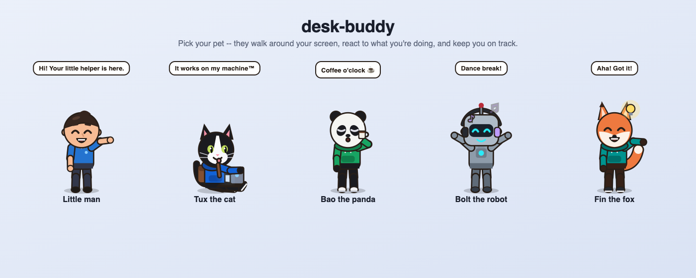
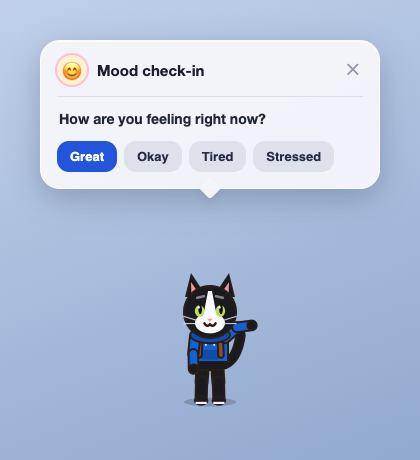
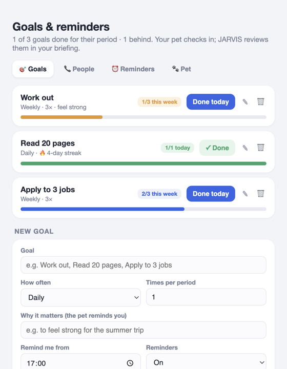
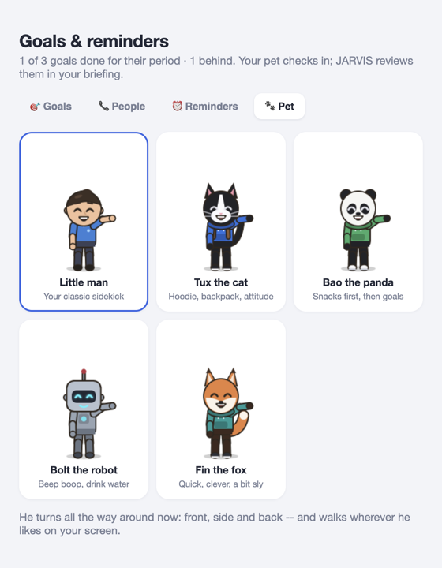
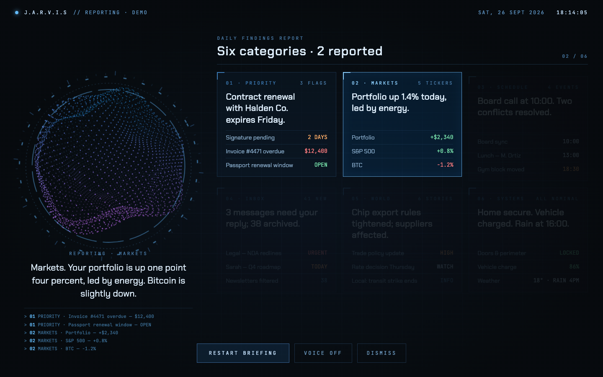
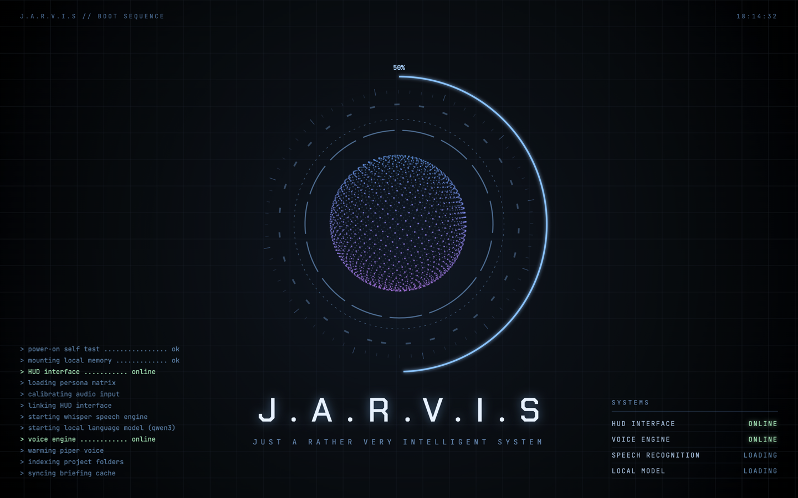
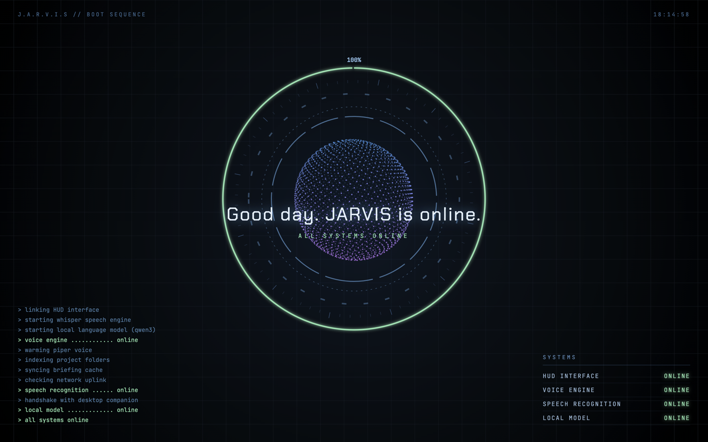
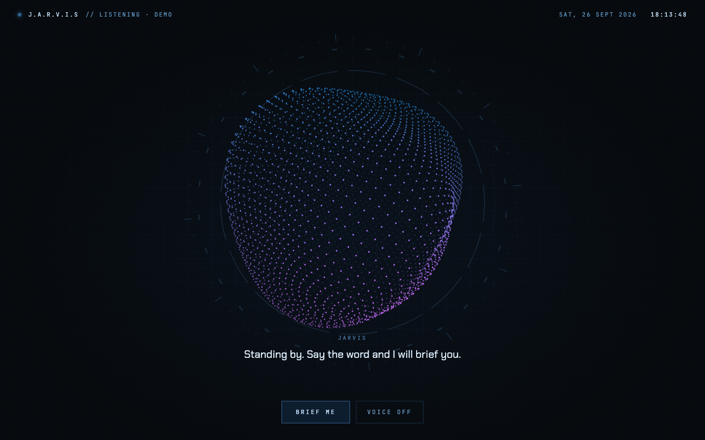

# desk-buddy

A little companion that lives on your Mac's screen -- and, if you want, a
fully local voice assistant behind it. No cloud, no account, no subscription.



**Two ways to use it:**

| | Pet only | JARVIS + Pet |
|---|---|---|
| Desktop pet (5 characters, walks around, reacts to what you're doing) | ✓ | ✓ |
| Goals, water breaks, mood check-ins, "call Mom" nudges, CPU alerts | ✓ | ✓ |
| Apple Health from your iPhone (via a Shortcut) | ✓ | ✓ |
| "Wake up Jarvis" voice assistant, running 100% on your Mac | | ✓ |
| Full-screen daily briefing on every display | | ✓ |
| Reminders & timers, memory, Apple Notes, documents, web previews by voice | | ✓ |
| Music, volume, directions, screenshots, battery... by voice | | ✓ |
| Chat window: type to JARVIS instead of talking (⌘⇧J) | | ✓ |
| Hold Space for 3 s: wake-up intro on every display | ✓ | ✓ |
| Needs | macOS + Node.js | + Homebrew, ~2 GB disk |

## Install

```bash
git clone https://github.com/tawuku/desk-buddy.git
cd desk-buddy
./install.sh --pet-only      # just the pet
# or
./install.sh                 # JARVIS + pet
# or
./install.sh --remote        # JARVIS + pet as a thin client: the heavy parts run
                             # on another computer (see computer/server/), so no
                             # models are downloaded to this Mac
```

Remove it again with `./uninstall.sh`.

## The pet

Pick **Little man, Tux the cat, Bao the panda, Bolt the robot or Fin the fox**
(🐾 menu bar icon -> *Goals & reminders…* -> Pet). It walks around your
screen in every direction and does something fitting for what you're doing:
types on a laptop while you code, scrolls a phone while you browse, wears a
headset on calls, dances to music, dozes when you're away -- and cracks the
odd joke. Click it, drag it, see what happens.

<p>
  
  
  
</p>

**Goals & reminders** (🐾 menu): log daily / weekly / monthly goals and the
people you want to stay in touch with. Your pet pops up small cards: goal
check-ins, water breaks, a mood check-in, "you haven't called Mom in 12 days",
ideas to surprise your partner, and a heads-up when your Mac's CPU is maxed
out. Quiet hours, and never while you're on a call.

**Apple Health**: an iPhone Shortcut drops your steps / sleep / activity into
iCloud Drive; the pet nudges you to walk, JARVIS reviews it in your briefing.
See [computer/health/README.md](computer/health/README.md).

## JARVIS

Say **"wake up Jarvis"**, then talk. Everything runs locally: wake word
(openWakeWord), speech recognition (whisper.cpp), a small language model
(Qwen3 1.7B on llama.cpp) and a natural voice (Piper).

**Run it on a Windows PC instead:** the model, speech recognition and voice can
live on a stronger/always-on PC while the Mac only listens and plays audio --
see [computer/server/](computer/server/README.md). Install the Mac side with
`./install.sh --remote` and it downloads no models at all; **PA** then shows
whether the PC is answering and which parts run there.

- "Give me an update" -- a full-screen briefing on all your screens:
  priorities, goals, health, notes, weather, inbox, projects, news.

  

- "Remind me to call Mom at 6", "set a timer for 10 minutes"
- "Remember that Anna loves sunflowers" (used in later answers)
- "I worked out today", "add a goal to read 3 times a week"
- "Open my CV" (and it tells you what's in it), "summarize it",
  "preview example.com", "read my latest note"
- "Play some music", "play Burna Boy", "pause", "next song", "what's playing?"
  (Spotify or Music), "set the volume to 40"
- "How do I get to Frankfurt?" -- drive time and distance, route opened in
  Apple Maps (also "by bike", "on foot", "by train")
- "Take a screenshot", "lock my screen", "how's my battery?", "turn on dark
  mode", "quit Spotify"
- "How's my shop doing?", "any new orders?" -- your own websites' admin
  numbers (sign-ups, orders, revenue, approvals waiting), with pet cards when
  something happens. See [computer/business/README.md](computer/business/README.md).
- "Thanks" / "that's all" / "go to sleep" ends the conversation.
- Rather type? **⌘⇧J** opens a chat window anywhere: answers stream in, and
  everyday things (time, weather, reminders, music) come back instantly.

JARVIS starts with your Mac and listens for "wake up Jarvis" -- the **first
wake after a restart plays the boot intro** (or hold **Space for 3 seconds**
any time). While plugged in it keeps your Mac from idle-sleeping so it can
still hear you (the display turns off as usual; set `"keep_awake"` in
`config/voice.json` to `"always"` or `"off"`). Stop / start it in **PA**:

<p>
  
  
</p>

While idle, JARVIS waits as a breathing particle orb:


 Settings:
`config/jarvis_sources.json` (your name, city, news feeds, project folders).

## Privacy

By default everything stays on your Mac. The only network calls are the lookups
you ask for (weather, news, web search, the one-time model downloads). If you
connect a [brain server](computer/server/README.md), your voice recordings and
questions go to that computer over your own network -- and if you give that
server a hosted-model API key, your questions (with the context JARVIS attaches
to them) go on to that provider. Your settings,
goals, memories and reminders live in `config/` and `database/`, which are
never committed.

## Layout

```
computer/pet/     desktop pet, goals & reminders (Electron)
computer/voice/   JARVIS voice app (Python)
computer/screen/  full-screen briefing + boot intro
computer/boot/    hold-Space boot key (Swift)
computer/pa/      PA control app (Electron)
computer/health/  Apple Health Shortcut guide
config/           settings (examples are committed; your own copies are not)
```

## License

MIT
